# Projet 01 – Rapport technique Wireshark

## 1. Objectif

Ce rapport documente deux volets complémentaires du Projet 01 :

1. l'analyse fondamentale d'un échange ICMP généré par une commande `ping` ;
2. une extension orientée SOC / Blue Team consacrée à l'investigation d'une activité de reconnaissance réseau.

L'objectif est de démontrer la capacité à capturer, filtrer, interpréter et corréler du trafic réseau avec Wireshark, puis à transformer les observations techniques en une conclusion d'analyste SOC structurée et prudente.

---

## 2. Environnement

### Machine hôte
- Windows 11
- Wireshark
- VMware Workstation Pro 17

### Machines virtuelles
- Windows 11 — `192.168.230.218`
- Kali Linux — `192.168.230.219`
- Windows Server 2022 — `192.168.230.220`

### Réseau
- VMware NAT — VMnet8
- Sous-réseau : `192.168.230.0/24`

---

## 3. Topologie du laboratoire

Le trafic est capturé depuis la machine hôte sur l'interface virtuelle **VMnet8**.

Le premier scénario consiste à observer un ping entre Windows 11 et Windows Server 2022. Le second consiste à analyser une activité TCP inhabituelle provenant de Kali Linux et ciblant Windows Server 2022.

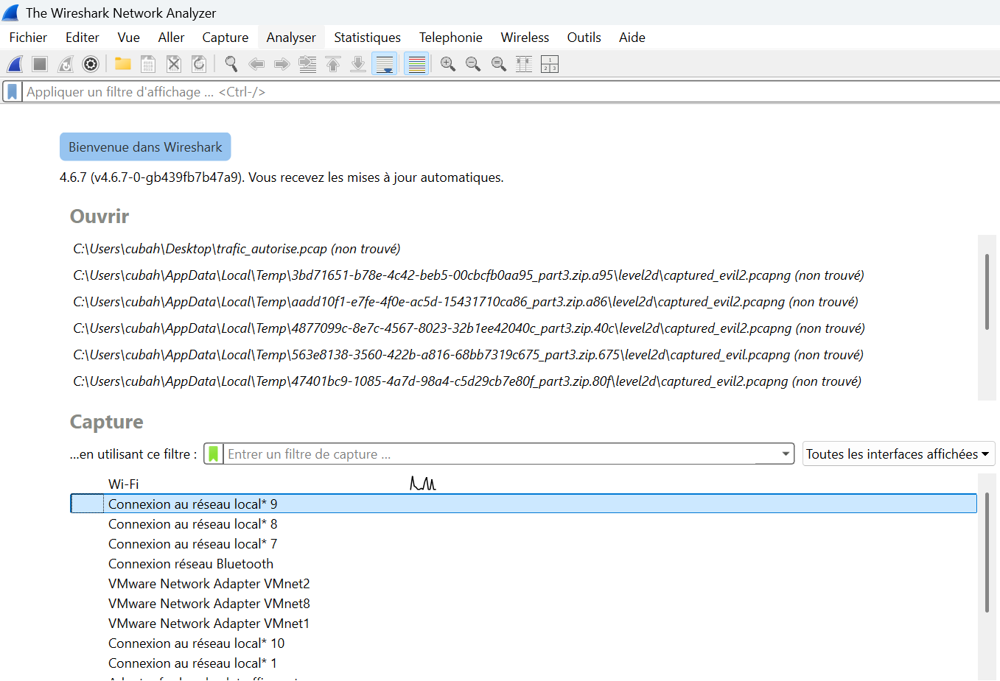

---

# Partie I — Analyse ICMP

## 4. Commande utilisée

```cmd
ping 192.168.230.220
```

Cette commande génère des messages ICMP Echo Request depuis Windows 11 (`192.168.230.218`) vers Windows Server 2022 (`192.168.230.220`).

---

## 5. Capture et filtrage

La capture a été réalisée sur VMnet8, puis le filtre suivant a été appliqué :

```text
icmp
```

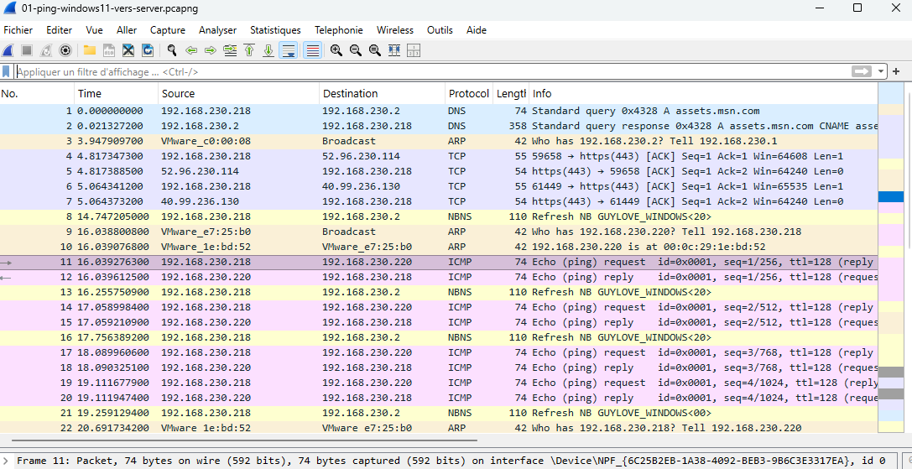

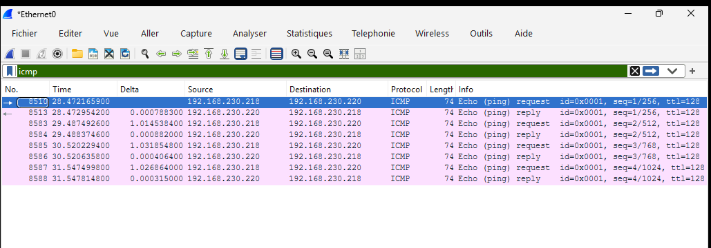

Le filtre permet d'isoler les messages ICMP au sein du trafic capturé.

---

## 6. Analyse Ethernet II et IPv4

L'analyse de l'en-tête Ethernet II permet d'identifier les adresses MAC source et destination utilisées pour la communication au niveau de la liaison de données.

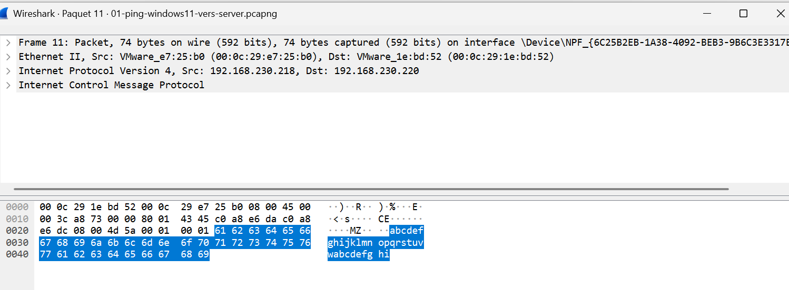

L'en-tête IPv4 observé contient notamment :

- Version : IPv4
- Header Length : 20 octets
- DSCP : CS0
- TTL : 128
- Protocol : ICMP
- Adresse source : `192.168.230.218`
- Adresse destination : `192.168.230.220`
- Checksum IPv4 présent, avec validation désactivée dans Wireshark lors de l'analyse

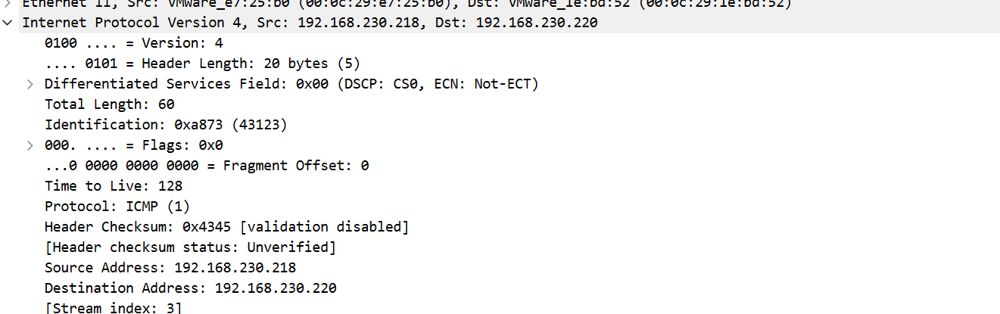

### Interprétation

La longueur de 20 octets correspond à la taille minimale d'un en-tête IPv4 sans options. Le TTL de 128 est cohérent avec une valeur initiale couramment utilisée par Windows. Le champ Protocol indique que la charge utile IPv4 est un message ICMP.

Le champ Identification peut être utilisé lors de la fragmentation pour associer les fragments appartenant au même datagramme. Le Fragment Offset observé à 0 et l'absence d'indicateur de fragmentation montrent que le paquet analysé n'est pas fragmenté.

---

## 7. Analyse ICMP

### Echo Request

La requête ICMP contient notamment :

- Type : 8 — Echo Request
- Code : 0
- Checksum valide
- Identifier : 1
- Sequence Number : 1
- Données : 32 octets

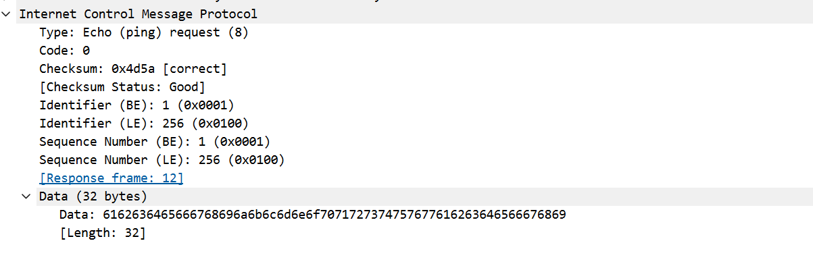

### Echo Reply

La réponse ICMP contient :

- Type : 0 — Echo Reply
- Code : 0
- Identifier identique à la requête
- Sequence Number identique à la requête
- Données de même longueur
- Response time observé : environ 0,336 ms

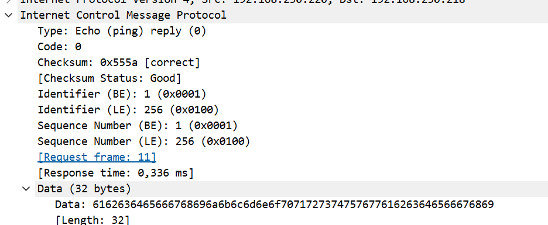

### Corrélation

Les champs Identifier et Sequence Number permettent d'associer la réponse à la requête correspondante. Wireshark fournit également des liens entre les trames de requête et de réponse.

Aucune perte de paquet n'a été observée et les temps de réponse sont très faibles, ce qui est cohérent avec une communication interne au laboratoire virtuel.

### Point de vue SOC

Cette première analyse constitue une **baseline de trafic normal**. Elle montre une communication ICMP attendue, bidirectionnelle, avec une requête et une réponse cohérentes.

---

# Partie II — Extension SOC : investigation d'une activité réseau inhabituelle

## 8. Contexte de l'investigation

Une activité réseau inhabituelle provenant de `192.168.230.219` et ciblant `192.168.230.220` a été capturée dans un second fichier PCAP.

L'objectif de l'investigation est de déterminer la nature du comportement uniquement à partir des observations réseau, puis de qualifier le risque sans confondre activité suspecte, exploitation et compromission.

Les questions principales de l'investigation sont :

- quelle machine initie l'activité ?
- quelle machine est ciblée ?
- quels protocoles et ports sont concernés ?
- quelle est la durée du comportement ?
- la communication ressemble-t-elle à du trafic normal ?
- existe-t-il des indicateurs réseau pertinents ?
- plusieurs événements peuvent-ils être corrélés ?
- quelle technique MITRE ATT&CK correspond au comportement observé ?

---

## 9. Triage initial

### Hiérarchie des protocoles

La capture contient plus de 5 000 trames. La hiérarchie des protocoles montre une forte présence d'IPv4 et TCP, avec également du trafic UDP, QUIC, TLS, DNS, LDAP, ARP et HTTP.

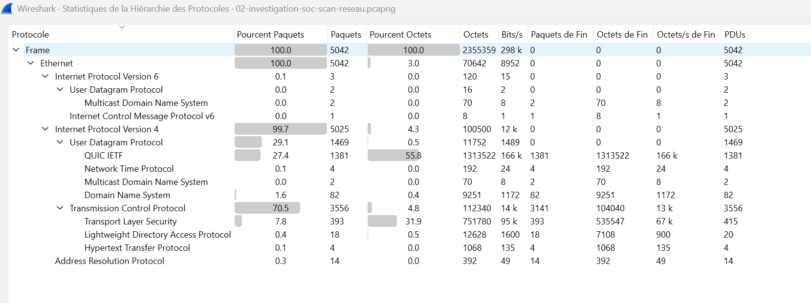

Cette vue permet d'obtenir rapidement une image globale de la capture avant d'isoler un hôte ou un protocole spécifique.

### Conversations IPv4

La vue Conversations met en évidence une relation particulièrement importante entre :

- `192.168.230.219`
- `192.168.230.220`

La conversation observée comprend environ 2 042 paquets, dont environ 2 028 dans le sens `.219 → .220` et seulement 14 dans le sens inverse, sur une durée d'environ 4,63 secondes.

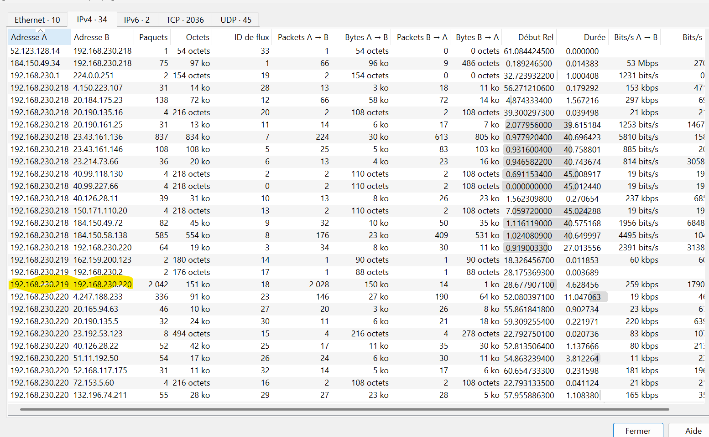

### Première hypothèse

La forte asymétrie et la concentration temporelle indiquent un comportement inhabituel nécessitant une analyse approfondie. À ce stade, l'hypothèse retenue est une possible activité automatisée de découverte ou de reconnaissance réseau.

---

## 10. Analyse des SYN TCP

Le filtre suivant a été utilisé pour isoler les tentatives initiales de connexion TCP depuis la source vers la cible :

```text
ip.src == 192.168.230.219 && ip.dst == 192.168.230.220 && tcp.flags.syn == 1 && tcp.flags.ack == 0
```

Wireshark affiche environ **2 000 SYN** correspondant à de nombreuses tentatives vers des ports de destination différents.

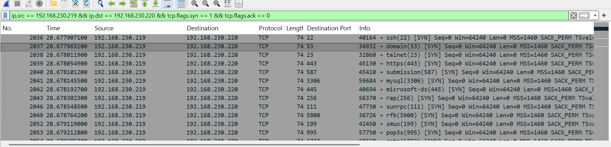

Le comportement observé est différent d'une conversation applicative normale : un même hôte cible rapidement un très grand nombre de ports d'une même machine.

---

## 11. Analyse des réponses SYN/ACK

Le filtre suivant permet d'isoler les réponses positives du serveur :

```text
ip.src == 192.168.230.220 && ip.dst == 192.168.230.219 && tcp.flags.syn == 1 && tcp.flags.ack == 1
```

Plusieurs SYN/ACK ont été observés, correspondant à des services TCP accessibles au moment de la capture.

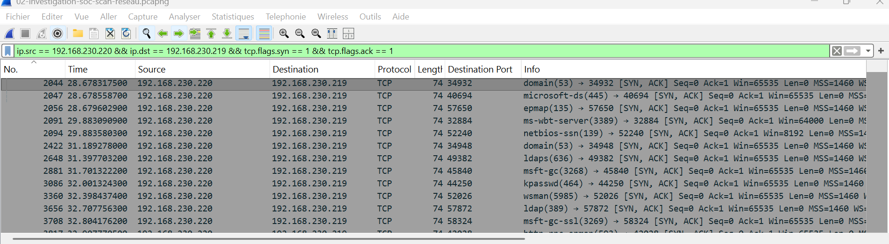

Parmi les ports observés figurent notamment des services cohérents avec une infrastructure Windows / Active Directory, par exemple SMB, RDP, LDAP, LDAPS et WinRM.

Cette observation ne prouve pas une vulnérabilité. Elle indique uniquement que les services acceptaient des connexions TCP depuis la source au moment de la capture.

---

## 12. Conversations TCP

La vue Conversations TCP révèle environ **1 988 conversations filtrées**, dont un grand nombre sont constituées de très peu de paquets vers des ports différents de la même cible.

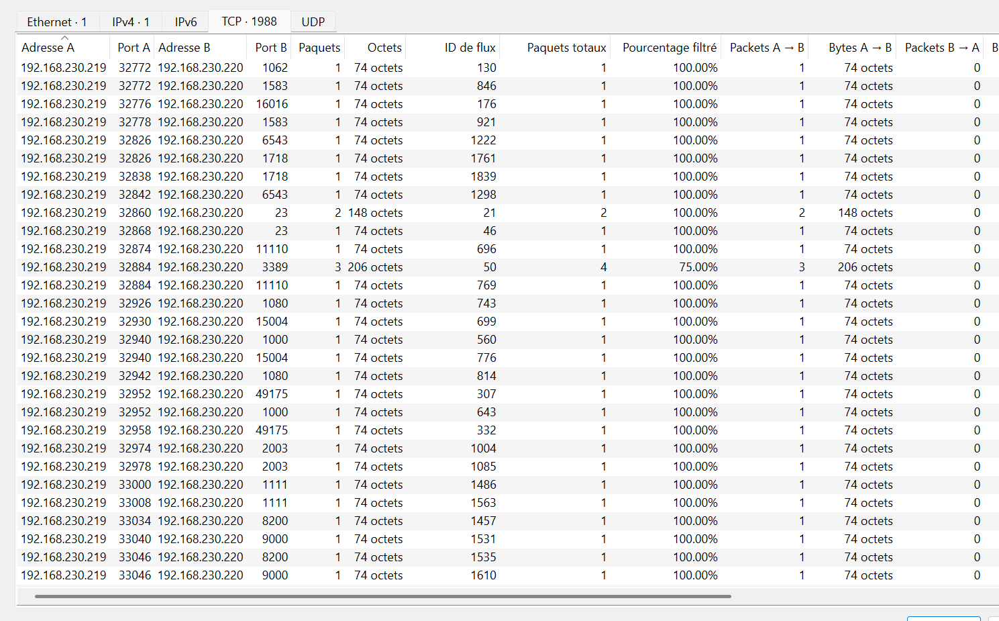

Ce pattern renforce l'hypothèse d'une activité automatisée de découverte de services.

---

## 13. Corrélation sur le port 445/TCP

Pour examiner une communication complète vers SMB, le filtre suivant a été utilisé :

```text
ip.addr == 192.168.230.219 && ip.addr == 192.168.230.220 && tcp.port == 445
```

La séquence observée est :

1. `192.168.230.219 → 192.168.230.220:445` — SYN
2. `192.168.230.220:445 → 192.168.230.219` — SYN/ACK
3. `192.168.230.219 → 192.168.230.220:445` — ACK
4. `192.168.230.219 → 192.168.230.220:445` — RST/ACK

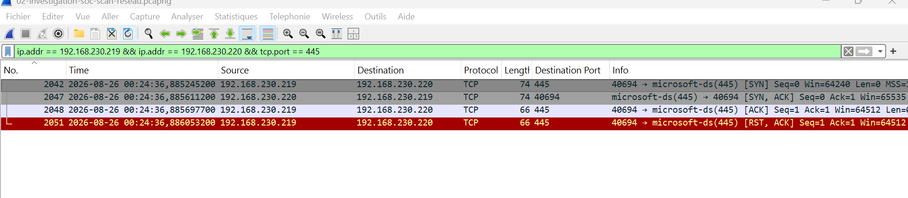

Le three-way handshake est donc complété, puis la connexion est rapidement interrompue par la source. Cela est compatible avec un test d'accessibilité du service plutôt qu'avec une longue utilisation applicative.

---

## 14. Chronologie de l'incident

Le premier SYN correspondant à l'activité étudiée est :

- Paquet : `2036`
- Timestamp : `2026-08-26 00:24:36,884959600`
- Source : `192.168.230.219`
- Destination : `192.168.230.220:22/TCP`

Le dernier SYN est :

- Paquet : `4079`
- Timestamp : `2026-08-26 00:24:41,513415900`
- Source : `192.168.230.219`
- Destination : `192.168.230.220:2008/TCP`

La fenêtre d'activité est d'environ **4,63 secondes**.

Avec environ 2 000 SYN sur cette période, le débit moyen est d'environ **432 SYN par seconde**.

### Événements représentatifs

| Ordre | Événement | Interprétation |
|---:|---|---|
| 1 | Premier SYN vers `22/TCP` | Début observable de l'activité étudiée |
| 2 | Tentative vers `445/TCP` | Test du service SMB |
| 3 | SYN/ACK depuis `445/TCP` | Service TCP accessible |
| 4 | Handshake complété puis RST/ACK | Connexion rapidement interrompue |
| 5 | Tentative/réponse sur `3389/TCP` | RDP accessible |
| 6 | Tentative/réponse sur `636/TCP` | LDAPS accessible |
| 7 | Tentative/réponse sur `5985/TCP` | WinRM accessible |
| 8 | Tentative/réponse sur `389/TCP` | LDAP accessible |
| 9 | Dernier SYN observé vers `2008/TCP` | Fin observable de la séquence SYN étudiée |

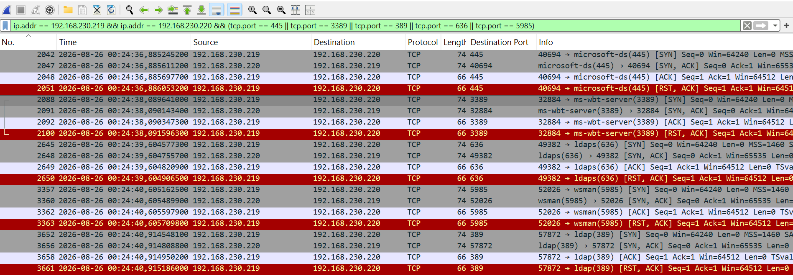

La proximité temporelle de ces événements et la répétition d'un même pattern sur plusieurs services renforcent l'hypothèse d'une reconnaissance automatisée.

---

## 15. Indicateurs réseau et IOC

### Distinction importante

Les adresses privées `192.168.230.219` et `192.168.230.220` ne constituent pas, à elles seules, des IOC de compromission.

L'investigation a identifié des **indicateurs comportementaux suspects** :

- environ 2 000 SYN vers une seule cible ;
- grand nombre de ports différents ;
- environ 4,63 secondes d'activité ;
- environ 432 SYN/s en moyenne ;
- près de 1 988 conversations TCP ;
- nombreuses conversations très courtes ;
- plusieurs services TCP accessibles ;
- répétition du pattern SYN → SYN/ACK → ACK → RST/ACK.

Ces éléments sont fortement compatibles avec une activité de reconnaissance de services.

### Ce qui n'est pas démontré

La capture ne permet pas d'établir :

- l'exploitation effective d'un service ;
- une compromission du serveur ;
- une authentification malveillante ;
- la présence d'un malware ;
- l'identité certaine de l'outil responsable.

---

## 16. Mapping MITRE ATT&CK

Le comportement observé correspond fortement à :

- **Tactique : Discovery — `TA0007`**
- **Technique : Network Service Scanning — `T1046`**

### Justification

Le mapping est basé sur plusieurs observations convergentes :

- volume élevé de tentatives TCP ;
- grand nombre de ports ciblés ;
- activité fortement concentrée dans le temps ;
- nombreuses conversations de très courte durée ;
- identification de plusieurs services accessibles.

**Niveau de confiance : élevé.**

Le mapping décrit le comportement observé, mais ne permet pas à lui seul de déterminer l'intention de l'opérateur. Un scan peut également être réalisé dans un cadre légitime : audit, inventaire, supervision ou analyse de vulnérabilités.

---

## 17. Évaluation de la sévérité

**Sévérité proposée : Moyenne**

### Justification

L'activité permet potentiellement d'identifier la surface réseau exposée de la cible et de découvrir des services utiles à une phase ultérieure d'attaque.

La sévérité n'est toutefois pas classée élevée ou critique car :

- aucune exploitation n'est démontrée ;
- aucune authentification malveillante n'est observée ;
- aucune compromission n'est confirmée ;
- aucun impact sur la disponibilité ou l'intégrité n'est identifié.

La priorité réelle dépendrait fortement du contexte : un scanner autorisé ou un outil d'inventaire peut produire un comportement similaire.

---

## 18. Investigations complémentaires

Dans un environnement SOC réel, les étapes suivantes seraient nécessaires pour déterminer si l'activité était autorisée et si elle a été suivie d'autres actions :

### Sur la source `192.168.230.219`
- identifier le processus responsable des connexions ;
- identifier l'utilisateur connecté ;
- vérifier la ligne de commande exécutée ;
- consulter Sysmon, l'EDR et les journaux système.

### Sur la cible `192.168.230.220`
- vérifier les connexions acceptées ;
- examiner les journaux du pare-feu ;
- rechercher des événements d'authentification ;
- rechercher des accès SMB, RDP, LDAP ou WinRM ultérieurs.

### Au niveau de l'infrastructure
- corréler avec les logs du pare-feu ;
- consulter IDS/IPS et SIEM ;
- analyser les journaux DNS et DHCP ;
- rechercher une activité similaire vers d'autres systèmes.

---

## 19. Recommandations SOC

En cas d'activité similaire non autorisée dans un environnement de production :

1. vérifier si l'adresse source correspond à un scanner ou à un administrateur autorisé ;
2. identifier l'utilisateur et le processus à l'origine des connexions ;
3. rechercher si la même source a ciblé d'autres systèmes ;
4. examiner les événements Windows et les données EDR de la source et de la cible ;
5. rechercher des authentifications ou connexions ultérieures sur les services découverts ;
6. vérifier les journaux du pare-feu, IDS/IPS et SIEM ;
7. limiter l'accès à RDP, SMB, WinRM et aux services d'administration aux systèmes réellement nécessaires ;
8. appliquer la segmentation réseau et le principe du moindre privilège réseau ;
9. créer ou ajuster des règles de détection pour les scans de ports anormalement rapides ;
10. escalader l'incident si une activité postérieure à la reconnaissance est identifiée.

---

## 20. Filtres Wireshark utilisés pendant l'investigation

```text
ip.addr == 192.168.230.219
```

```text
ip.addr == 192.168.230.219 && ip.addr == 192.168.230.220
```

```text
ip.src == 192.168.230.219 && ip.dst == 192.168.230.220
```

```text
tcp && ip.src == 192.168.230.219 && ip.dst == 192.168.230.220
```

```text
ip.src == 192.168.230.219 && ip.dst == 192.168.230.220 && tcp.flags.syn == 1 && tcp.flags.ack == 0
```

```text
ip.src == 192.168.230.220 && ip.dst == 192.168.230.219 && tcp.flags.syn == 1 && tcp.flags.ack == 1
```

```text
ip.src == 192.168.230.220 && ip.dst == 192.168.230.219 && tcp.flags.reset == 1
```

```text
ip.addr == 192.168.230.219 && ip.addr == 192.168.230.220 && tcp.port == 445
```

```text
ip.addr == 192.168.230.219 && ip.addr == 192.168.230.220 && tcp.port == 3389
```

```text
ip.addr == 192.168.230.219 && ip.addr == 192.168.230.220 && (tcp.port == 445 || tcp.port == 3389 || tcp.port == 389 || tcp.port == 636 || tcp.port == 5985)
```

---

## 21. Preuves et fichiers associés

### Captures réseau

- `01-ping-windows11-vers-server.pcapng`
- `02-investigation-soc-scan-reseau.pcapng`

### Captures d'écran principales

- `01-interface-vmnet8.png`
- `02-capture-icmp.png`
- `03-filtre-icmp.png.png`
- `04-details-paquet-icmp.png`
- `05-details-entete-ipv4.png.png`
- `06-icmp-echo-request.png`
- `07-icmp-echo-reply.png`
- `08-hierarchie-protocoles-investigation.png`
- `09-conversations-ipv4-investigation.png`
- `10-syn-multiples-ports.png`
- `11-synack-ports-accessibles.png`
- `12-conversations-tcp-multiples-ports.png`
- `13-correlation-tcp-port-445.png`
- `14-chronologie-services-reseau.png`

---

## 22. Compétences développées

À l'issue de ce projet, je suis capable de :

- capturer et sauvegarder du trafic réseau au format PCAPNG ;
- sélectionner une interface VMware adaptée ;
- utiliser des filtres d'affichage Wireshark ;
- interpréter les protocoles Ethernet II, IPv4, ICMP et TCP ;
- analyser Echo Request et Echo Reply ;
- interpréter TTL, fragmentation, checksums, flags TCP et ports ;
- effectuer le triage d'une capture réseau ;
- distinguer une baseline normale d'un comportement inhabituel ;
- identifier une activité fortement compatible avec une reconnaissance réseau ;
- qualifier des indicateurs réseau sans les confondre avec des IOC de compromission confirmés ;
- corréler plusieurs paquets et conversations ;
- construire une chronologie d'incident ;
- mapper une observation à MITRE ATT&CK ;
- évaluer la sévérité et le niveau de confiance ;
- formuler des recommandations Blue Team ;
- documenter une investigation de manière professionnelle.

---

## 23. Conclusion

Le projet a commencé par l'analyse d'un échange ICMP normal entre deux machines du laboratoire. Cette première partie a permis de maîtriser les bases de Wireshark, les filtres d'affichage et l'interprétation des en-têtes Ethernet II, IPv4 et ICMP.

L'extension SOC a ensuite permis d'appliquer ces compétences à une situation d'investigation réseau. L'analyse a révélé une activité TCP automatisée provenant de `192.168.230.219` et ciblant `192.168.230.220`, avec environ 2 000 SYN en 4,63 secondes vers de nombreux ports et plusieurs réponses SYN/ACK sur des services Windows / Active Directory.

L'ensemble des preuves est fortement compatible avec une activité de reconnaissance ou de découverte de services et correspond à la technique MITRE ATT&CK **T1046 — Network Service Scanning**, sous la tactique **TA0007 — Discovery**.

Aucune preuve d'exploitation ou de compromission n'a cependant été identifiée dans la capture. Cette distinction est essentielle dans une démarche SOC : les conclusions doivent rester limitées à ce que les données permettent réellement de démontrer.

Ce projet démontre ainsi une progression de l'analyse protocolaire fondamentale vers une investigation réseau Blue Team structurée, comprenant triage, corrélation, chronologie, qualification des indicateurs, mapping MITRE ATT&CK, évaluation de la sévérité et recommandations SOC.
