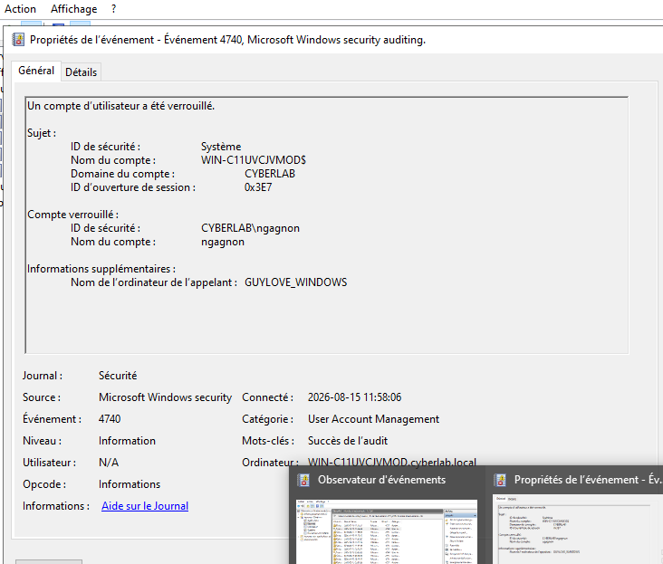
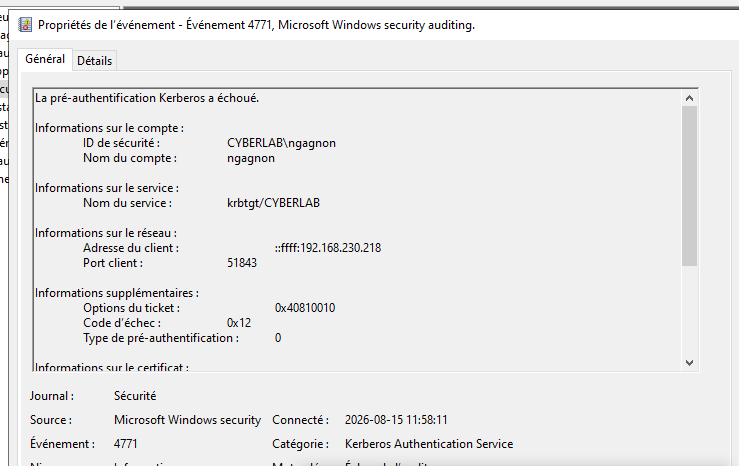

# Projet 03 — Active Directory : déploiement, sécurisation et investigation SOC

## Présentation

Ce projet présente la mise en place d'un environnement Microsoft Active Directory dans un laboratoire virtualisé, depuis le déploiement du contrôleur de domaine jusqu'à l'analyse d'événements de sécurité.

L'objectif était de reproduire un environnement d'entreprise permettant de pratiquer l'administration Active Directory, la gestion des accès, les stratégies de groupe, la sécurisation Windows et l'investigation d'incidents d'authentification.

> **Environnement contrôlé :** toutes les configurations, simulations et analyses présentées dans ce projet ont été réalisées dans un laboratoire personnel isolé.

## Architecture du laboratoire

| Machine | Rôle | Adresse IPv4 |
|---|---|---|
| Windows Server 2022 | Contrôleur de domaine, AD DS, DNS, partages | `192.168.230.220` |
| Windows 11 | Poste utilisateur membre du domaine | `192.168.230.218` |
| Kali Linux | Machine complémentaire de laboratoire | `192.168.230.219` |

**Domaine :** `cyberlab.local`  
**Nom NetBIOS :** `CYBERLAB`  
**Virtualisation :** VMware Workstation Pro  
**Réseau :** NAT
'

                    VMware NAT
                        |
        +---------------+---------------+
        |               |               |
        v               v               v
 Windows Server      Windows 11      Kali Linux
 192.168.230.220   192.168.230.218  192.168.230.219
        |
        +-- AD DS
        +-- DNS
        +-- Kerberos
        +-- GPO
        +-- SMB
        +-- Journaux de sécurité '


## Objectifs réalisés

- Déployer Active Directory Domain Services sur Windows Server 2022
- Créer le domaine `cyberlab.local`
- Configurer DNS pour Active Directory
- Construire une structure d'unités d'organisation
- Créer et administrer des utilisateurs et groupes
- Intégrer Windows 11 au domaine
- Configurer des partages SMB et leurs permissions
- Appliquer le principe du moindre privilège
- Créer et appliquer des stratégies de groupe
- Administrer Active Directory avec PowerShell
- Renforcer les politiques de mots de passe et de verrouillage
- Vérifier Microsoft Defender et le pare-feu Windows
- Configurer et analyser l'audit de sécurité
- Analyser des événements Kerberos
- Simuler et investiguer un verrouillage de compte
- Effectuer une validation finale de l'environnement

## Structure Active Directory

L'environnement a été organisé en unités d'organisation afin de séparer les différents types d'objets et faciliter l'application des stratégies.

Exemple de structure :

CYBERLAB
├── Utilisateurs
├── Ordinateurs
│   └── Postes-Utilisateurs
├── Groupes
└── Serveurs

Des départements ont également été créés, notamment RH, Finance et TI.

Les utilisateurs ont été associés à des groupes de sécurité correspondant à leurs fonctions.

## Gestion des accès et permissions

Des partages réseau ont été configurés afin de tester une gestion des accès basée sur les groupes Active Directory.

Les tests ont notamment permis de confirmer :

- l'accès autorisé à une ressource pour un utilisateur appartenant au groupe approprié ;
- le refus d'accès à une ressource non autorisée ;
- l'utilisation des groupes pour gérer les permissions plutôt que l'attribution individuelle des droits.

Cette approche permet d'appliquer plus facilement le principe du moindre privilège.

## Stratégies de groupe et sécurisation

Plusieurs stratégies ont été utilisées, notamment :

- `GPO-RH-Securite`
- `GPO-Postes-Securite`
- `Default Domain Policy`
- `Default Domain Controllers Policy`

L'application des stratégies a été vérifiée avec :

```cmd
gpupdate /force
gpresult /r

## Administration avec PowerShell

Plusieurs opérations Active Directory ont également été réalisées en ligne de commande.

Exemples de cmdlets utilisées :

```powershell
Get-ADUser
Get-ADGroup
Get-ADGroupMember
Get-ADPrincipalGroupMembership
Search-ADAccount
Disable-ADAccount
Enable-ADAccount
Set-ADUser
Add-ADGroupMember
Remove-ADGroupMember
Get-ADDefaultDomainPasswordPolicy

Ces commandes ont notamment été utilisées pour inventorier les objets AD, gérer des comptes et groupes et vérifier les paramètres de sécurité du domaine.


## Investigation SOC — Verrouillage d'un compte Active Directory

Un scénario contrôlé a été réalisé afin de simuler plusieurs échecs d'authentification contre le compte :

`CYBERLAB\ngagnon`

La politique du domaine a finalement verrouillé le compte après cinq tentatives incorrectes.

### Event ID 4740 — Account Lockout

L'analyse de l'événement a permis d'identifier :

- compte : `ngagnon`
- ordinateur appelant : `GUYLOVE_WINDOWS`

### Event ID 4771 — Kerberos Pre-Authentication Failure

Un événement Kerberos associé a permis d'identifier :

- compte : `ngagnon`
- service : `krbtgt/CYBERLAB`
- adresse source : `192.168.230.218`
- code d'échec observé : `0x12`

### Corrélation

La corrélation des journaux a permis d'établir :

`ngagnon → GUYLOVE_WINDOWS → 192.168.230.218`

Cette analyse illustre une démarche SOC consistant à corréler plusieurs événements avant de déterminer l'origine d'un incident d'authentification.

### Preuve — Verrouillage du compte



### Preuve — Échec Kerberos



## Dépannage

Le projet a également nécessité plusieurs phases de diagnostic.

### Synchronisation temporelle et Kerberos

Un problème de synchronisation temporelle a affecté certaines authentifications Kerberos. La cause a été identifiée avant de poursuivre l'analyse des événements.

### Application d'une GPO

`GPO-Postes-Securite` ne s'appliquait initialement pas au poste Windows 11.

L'analyse de :

```cmd
gpresult /r

a montré que l'objet ordinateur se trouvait dans le conteneur Computers plutôt que dans l'OU Postes-Utilisateurs.

Après déplacement de GUYLOVE_WINDOWS dans la bonne OU et actualisation des stratégies, la GPO a été correctement appliquée.

Outils de diagnostic utilisés :
dcdiag
nslookup
nltest
klist
gpupdate
gpresult
auditpol

Ces vérifications ont permis d'isoler les problèmes avant d'apporter des modifications à l'infrastructure


Cette section est importante pour montrer que le projet ne consiste pas simplement à suivre un assistant d'installation.


## Validation finale

Les contrôles finaux ont permis de valider :

- AD DS
- DNS
- SYSVOL et NETLOGON
- résolution DNS du domaine
- enregistrements SRV
- découverte du contrôleur de domaine
- canal sécurisé du poste Windows 11
- Kerberos
- GPO
- utilisateurs et groupes
- permissions des ressources
- politiques de sécurité
- audit Windows
- Microsoft Defender
- pare-feu Windows
- réseau `DomainAuthenticated`

Le contrôle final avec `dcdiag` n'a révélé aucune erreur critique empêchant le fonctionnement du domaine.

## Compétences démontrées

**Active Directory**
- AD DS
- DNS
- OU
- utilisateurs et groupes
- authentification de domaine
- Kerberos

**Administration Windows**
- Windows Server 2022
- Windows 11
- PowerShell
- SMB
- permissions
- GPO

**Sécurité**
- principe du moindre privilège
- politiques de mots de passe
- verrouillage de comptes
- Microsoft Defender
- pare-feu Windows
- audit de sécurité

**SOC / Investigation**
- Windows Event Viewer
- Event ID 4740
- Event ID 4771
- corrélation d'événements
- identification d'une machine source
- analyse d'échecs d'authentification

## Documentation détaillée

- [Rapport technique complet](rapport/03-rapport-active-directory.md)
- [Investigation SOC Active Directory](rapport/03-investigation-soc-ad.md)

## Conclusion

Ce projet m'a permis de construire et d'administrer un environnement Active Directory complet dans un laboratoire virtualisé, puis d'en renforcer la sécurité et d'analyser les événements générés par des scénarios d'authentification contrôlés.

Il combine administration Windows, Active Directory, sécurité des accès, PowerShell, GPO et investigation SOC.

État du projet
✅ Projet terminé

Ce laboratoire fait partie de mon portefeuille professionnel en cybersécurité.

Auteur
Guy Love Cubahiro

Portfolio réalisé dans le cadre de ma préparation à un poste d'analyste cybersécurité junior et/ou un poste d'analyste SOC junior.